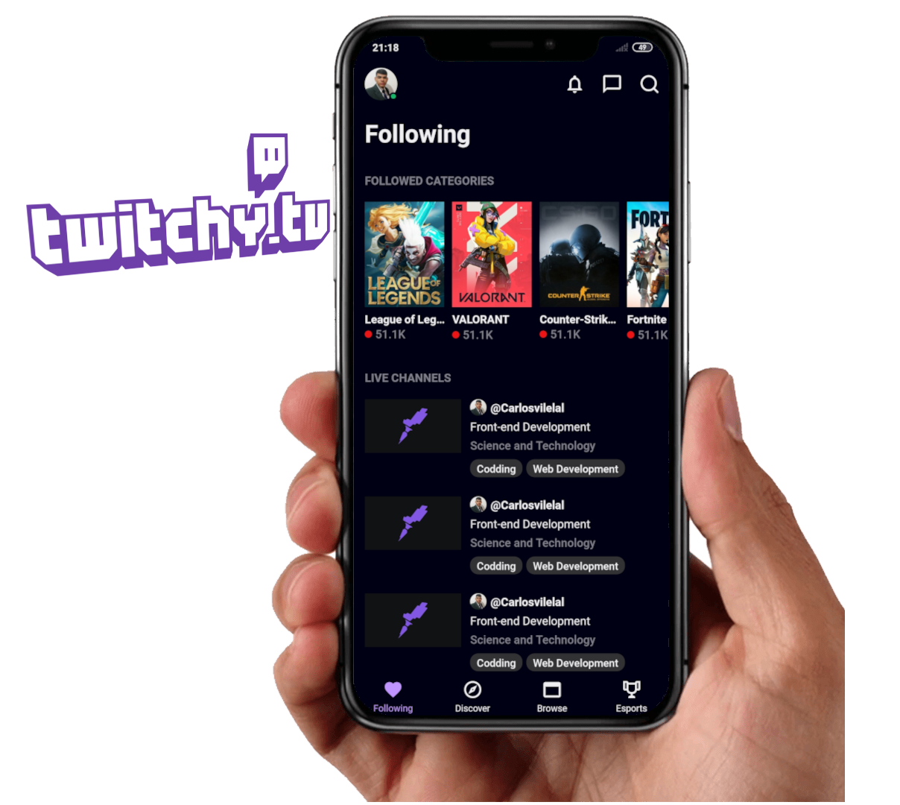
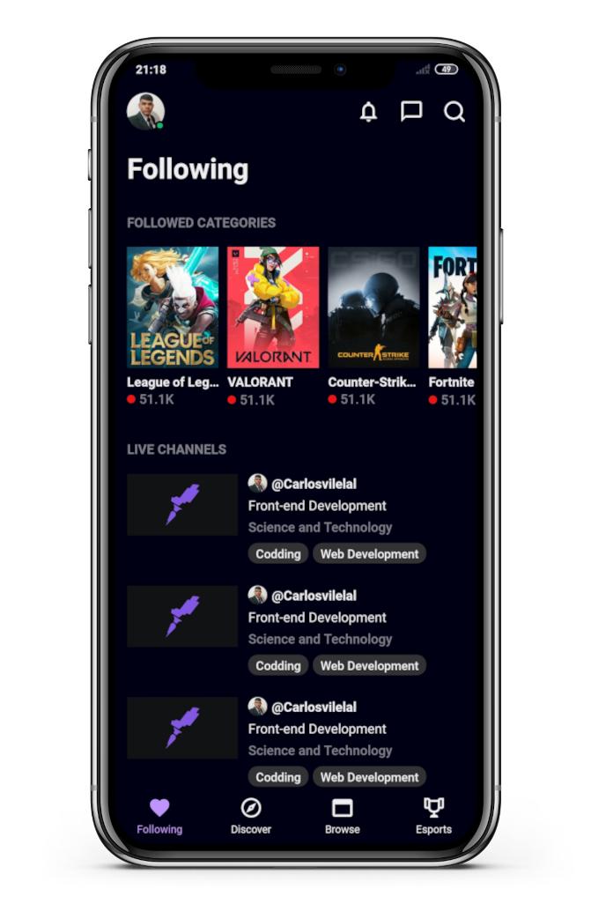
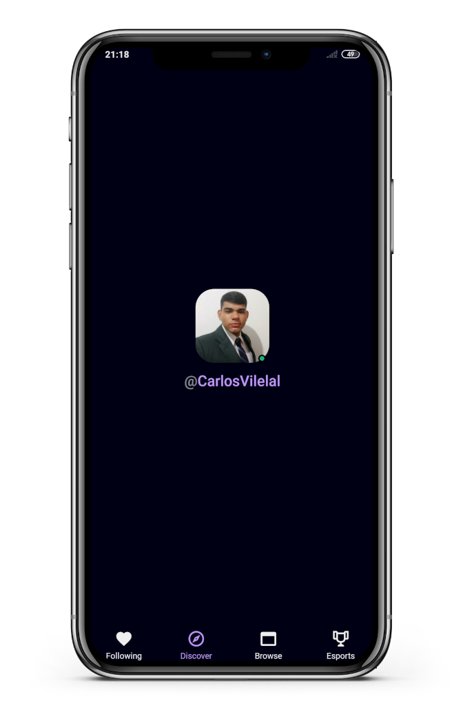
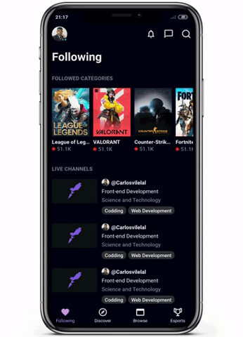

# ***App → Twitch.Tv :iphone:***

<h1 align=center>
  
</h1>

<div align=center>

![MIT][mit] ![Node_Badge][node_version_badge] ![Npm_Badge][npm_version_badge] ![React_Native_Badge][mobile_react-native_badge] ![NodeJS_Badge][server_nodejs_badge] [](https://github.com/ellerbrock/typescript-badges/)
  <a href="https://rocketseat.com.br" target="_blank">
    
  </a>
  
  <a href="https://www.linkedin.com/in/luiz-carlos-vilela" target="_blank"> 
    
  </a>

</div>

<br />

<h3 align=center>
  
:books:
***TwitchTv-Clone*** é um projeto para replicar a interface do aplicativo Twitch.Tv desenvolvido na **(UI Clone)** da **[Rocketseat][rocketseat_site]** utilizando as tecnologias ***TypeScript, Node, React-Native e Styled-Components***

</h3>

<h2 align=center>
  <i>Telas </i> :iphone:
</h2>

<div align=center >  
  <table align=center border="0">
  <tr align=center>
    <th ><strong> <i> Following </i> </strong></th>
    <th ><strong> <i> ComingSoon </i> </strong></th>
  </tr>
                                
  <tr align=center >
    <td >
       
    </td>
    <td >  </td>

  </tr>
</table>
</div>

<h2 align=center>
  <i>Navegação 🎬</i>
 </h2>
<div align=center >  
  
</div>

## ***:rocket: OBJETIVO***

<p align=justify> 
O projeto tem como finalidade desenvolver uma aplicação mobile com a aparência igual ao aplicativo de lives <strong>Twitch.Tv</strong>. Ao decorrer do projeto tenho como objetivo também desenvolver conhecimento em <strong>React-Native</strong>, <strong>TypeScript</strong> e <strong> Styled-Components</strong>.
</p>

## ***:computer: TECNOLOGIAS***

#### ***:iphone: Mobile*** ([React Native][react_native] + [TypeScript][typescript])
  - ***[Expo][expo]***
  - ***[Expo Google Fonts][expo_google_fonts]***
  - ***[React Navigation][react_navigation]***
  - ***[Expo Constants][expo_constants]***
  - ***[React Native SVG][react_native_svg]***
  

  Arquivo json do front-end mobile <kbd>[package.json](https://github.com/LuizCarlosVilela/twitchtv-clone/blob/master/package.json)</kbd>

### ***Utilitários***

- Editor: **[Visual Studio Code][vscode]**;

## ***:wine_glass: COMO UTILIZAR***

### ***Configurações Iniciais***

Primeiro, você precisa ter o <kbd>[NodeJS](https://nodejs.org/en/download/)</kbd> instalado na sua máquina. 

Se você estiver utilizando o **Linux**, você pode optar por instalar o **Node** através do gerênciador de versões <kbd>[asdf]</kbd> para facilitar o processo de mudança da versão do **Node**, quando for necessário.

Você pode optar também por utilizar o **yarn** no lugar do **npm**. Você pode instalar clicando nesse <kbd>[link][yarn]</kbd>, ou através do <kbd>[asdf]</kbd>.

Após ter o **Node** instalado, instale as dependências do **React e React Native (Expo)** de forma global, utilizando os comandos:

```sh
# Expo (React Native):
$ npm install -g expo-cli 
```

### ***Expo ([React Native](https://reactnative.dev/docs/getting-started))***

Instale as dependências contidas nos arquivos `package.json` que se encontram na raíz do repositório (para o gerenciamento de commits). Para instalar as dependências, basta abrir o terminal no diretório e digitar o comando:

```sh
$ npm install

# ou
$ yarn
```

Exemplos:

```sh

# Instalando as dependências do mobile:
$ cd twitchtv-clone
$ npm install
```

Veja os arquivos **`package.json`** do <kbd>[Package.Json](./package.json)</kbd>.

### ***Utilizando o Mobile***

Instale o aplicativo <kbd>[Expo](https://play.google.com/store/apps/details?id=host.exp.exponent&hl=en)</kbd> no seu smartphone.

```sh
# Executando o mobile no modo de desenvolvimento:
$ npm run start
```

Agora, abra o aplicativo do expo e no modo **LAN** faça o scan do QRCode.
## ***:star2: AGRADECIMENTOS***

<div align=center>

<table style="width:100%">
  <tr align=center>
    <th><strong>Rocketseat</strong></th>
    <th><strong>diego3g</strong></th>
    <th><strong>guilhermerodz</strong></th>
  </tr>
  <tr align=center>
    <td>
      <a href="https://rocketseat.com.br/">
        
      </a>
    </td>
    <td>
      <a href="https://github.com/diego3g">
        
      </a>
    </td>
    <td>
      <a href="https://github.com/guilhermerodz">
        
      </a>
    </td>
  </tr>
</table>

</div>

## ***:books: REFERÊNCIAS***

- ***[React + TypeScript](https://github.com/typescript-cheatsheets/react-typescript-cheatsheet)***
- ***[TypeScript](https://www.typescriptlang.org/docs/home.html)***
- ***[React Native](https://reactnative.dev/docs/getting-started)***
- ***[Expo](https://expo.io/learn)***
- ***[Node](https://nodejs.org/en/)***

## ***:page_with_curl: LICENÇA***

Este repositório está licenciado pela **MIT LICENSE**. Para mais informações detalhadas, leia o arquivo [LICENSE](./LICENSE) contido nesse repositório. 

 <i> <h2 align="center">Feito com ❤️ por <a href="https://www.linkedin.com/in/luiz-carlos-vilela/"> Luiz Carlos Vilela </a></h2> </i>
 
 
<!-- Website Links -->

[rocketseat_site]: https://rocketseat.com.br/

<!-- Badges -->

[mit]: https://img.shields.io/badge/license-MIT-brightgreen

[github_issues_badge]: https://img.shields.io/github/issues/marcospbrandao/ecoleta?color=green

[repository_license_badge]: https://img.shields.io/github/license/marcospbrandao/ecoleta

[node_version_badge]: https://img.shields.io/badge/node-12.17.0-green

[npm_version_badge]: https://img.shields.io/badge/npm-6.14.4-red

[web_react_badge]: https://img.shields.io/badge/web-react-blue

[mobile_react-native_badge]: https://img.shields.io/badge/mobile-react%20native-blueviolet

[server_nodejs_badge]: https://img.shields.io/badge/server-nodejs-important

<!-- Techs -->

[typescript]: https://www.typescriptlang.org/

[node]: https://nodejs.org/en/

[leaflet]: https://react-leaflet.js.org/en/

[vscode]: https://code.visualstudio.com/

[react_native]: http://www.reactnative.com/

[stackedit]: https://stackedit.io

[vscode_sqlite_extension]: https://marketplace.visualstudio.com/items?itemName=alexcvzz.vscode-sqlite

[markdown_emoji]: https://gist.github.com/rxaviers/7360908

[commitlint]: https://github.com/conventional-changelog/commitlint

[tsnode]: https://github.com/TypeStrong/ts-node

[feather_icons]: https://feathericons.com/

[insomnia]: https://insomnia.rest/

[react_leaflet]: https://react-leaflet.js.org/

[react_icons]: https://react-icons.github.io/react-icons/

[expo]: https://expo.io/

[expo_constants]: https://docs.expo.io/versions/latest/sdk/constants/

[react_native_svg]: https://github.com/react-native-community/react-native-svg

[firebase]: https://firebase.google.com/docs/

[asdf]: https://github.com/asdf-vm/asdf

[yarn]: https://classic.yarnpkg.com/en/docs/install/#debian-stable

[axios]: https://github.com/axios/axios

[expo_google_fonts]: https://github.com/expo/google-fonts

[react_navigation]: https://reactnavigation.org/

